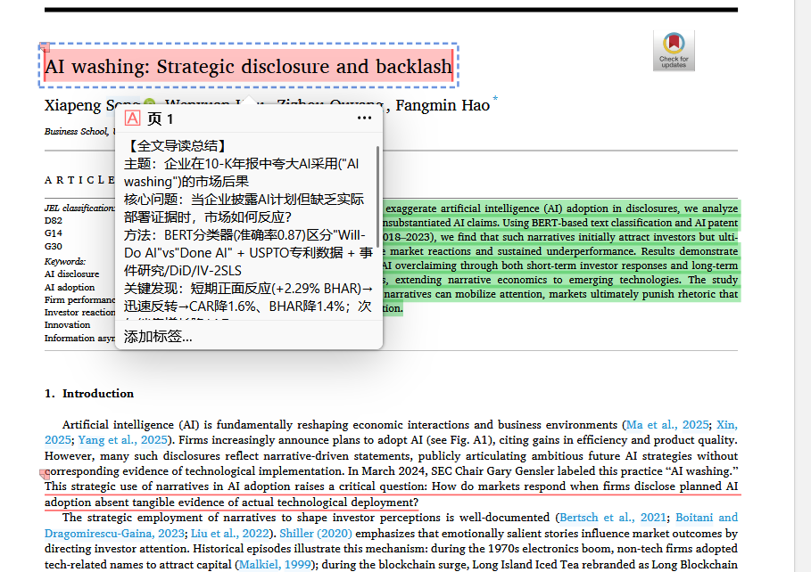
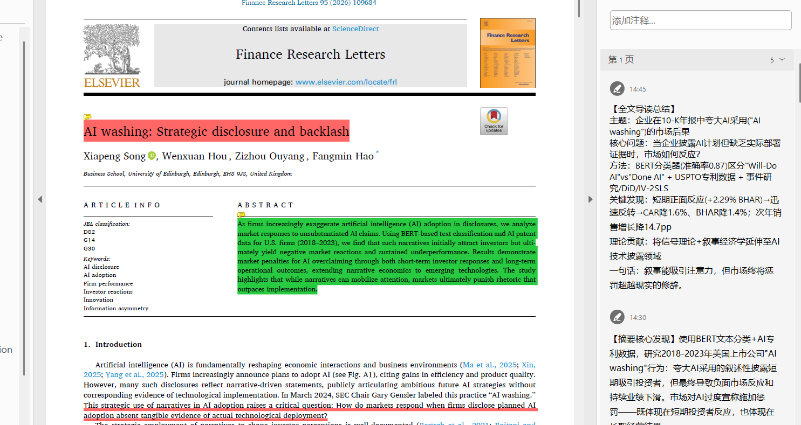
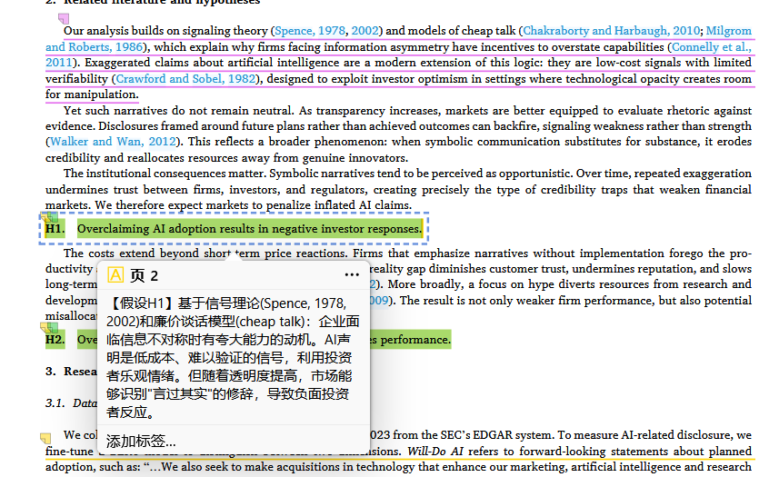
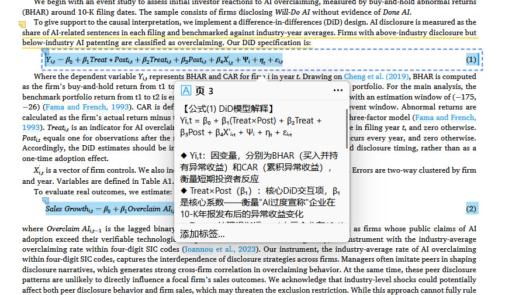
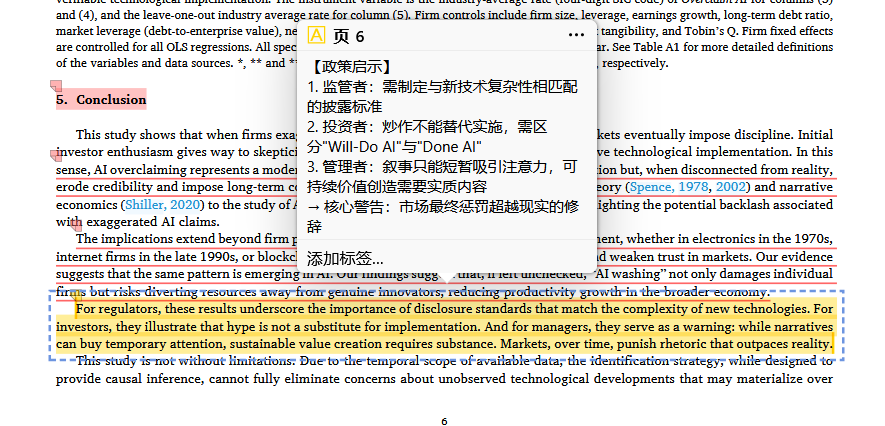
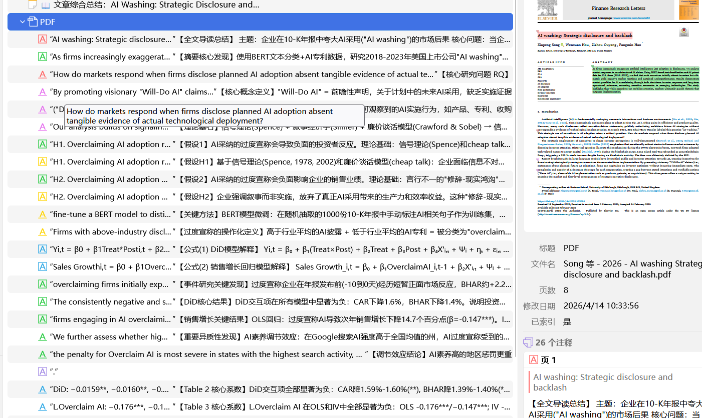
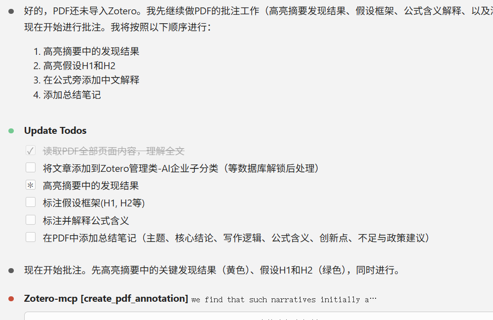

<div align="center">

# Zotero MCP — AI-Powered Paper Reading Assistant

**Turn your Zotero library into an intelligent research assistant.**

AI reads your papers, highlights key findings, explains formulas, and writes structured notes — all inside Zotero.

[](LICENSE)
[](https://python.org)
[](https://www.zotero.org)
[](https://modelcontextprotocol.io)

[Features](#-features) · [Quick Start](#-quick-start-3-minutes) · [Usage Examples](#-usage-examples) · [Screenshots](#-screenshots) · [Roadmap](#-roadmap)

</div>

---

## What Can It Do?

| You say... | AI does... |
|------------|------------|
| "高亮摘要中的发现结果" | Reads the abstract, identifies findings, highlights them in green |
| "解释第3页的公式" | Extracts the formula, adds a Chinese explanation as a note annotation |
| "写一份结构化阅读笔记" | Generates a note with contributions, methods, results, limitations — saved to Zotero |
| "以 MICRO 审稿人视角审阅" | Produces a structured review with scores and actionable feedback |

<div align="center">

### AI reads the paper → understands content → creates precise annotations



*AI generates a structured reading summary with key findings, methods, and conclusions*

</div>

---

## ✨ Features

### 9 MCP Tools

| Tool | What it does | Zotero open? |
|------|-------------|:---:|
| `search_zotero_items` | Search by title / author / key | ✅ |
| `list_zotero_items` | Browse recent items | ✅ |
| `get_item_metadata` | Get authors, year, venue, DOI | ✅ |
| `get_pdf_text_bulk` | Extract full text (no coords, fast) | ✅ |
| `get_pdf_layout_text` | Extract text + precise coordinates | ✅ |
| `list_annotations` | View existing annotations | ✅ |
| `create_pdf_annotation` | Create highlight / underline | Close Zotero |
| `batch_annotate` | Create multiple annotations at once | Close Zotero |
| `add_child_note` | Add a note to any item | Close Zotero |

### 3 Claude Code Skills (Slash Commands)

| Command | Function |
|---------|----------|
| `/zotero-annotate` | Smart annotation with semantic color coding |
| `/zotero-summarize` | Structured reading notes saved to Zotero |
| `/zotero-review` | Simulated peer review with scoring rubric |

### Smart Design

- **Two-phase workflow** — Reads full text first (cheap), then only gets coordinates for target sentences (precise). Reduces context usage by 63–80%.
- **Auto-skip references** — Detects "References" section and skips it. A 21-page paper extracts only 13 pages.
- **Batch annotations** — Creates 10 highlights in 1 API call instead of 10.
- **Friendly errors** — Write failures return `"please close Zotero"` instead of crashing.

---

## 🚀 Quick Start (3 Minutes)

### Step 1: Clone & Install

```bash
git clone https://github.com/dengls24/zotero-mcp.git
cd zotero-mcp

python -m venv .venv
# Windows:
.venv\Scripts\activate
# Linux/Mac:
# source .venv/bin/activate

pip install pymupdf mcp
```

### Step 2: Configure Claude Code

Add to `~/.claude.json` (or via Claude Code Settings > MCP Servers):

```json
{
  "mcpServers": {
    "zotero-mcp": {
      "command": "YOUR_PATH/zotero-mcp/.venv/Scripts/python.exe",
      "args": ["YOUR_PATH/zotero-mcp/zotero_mcp/server.py"],
      "env": {
        "ZOTERO_DATA_DIR": "YOUR_ZOTERO_DATA_DIR"
      }
    }
  }
}
```

> **Finding your Zotero data directory:** Zotero → Edit → Settings → Advanced → Files and Folders → Data Directory Location

### Step 3: Use It

Just talk to Claude naturally:

```
用Zotero把这篇论文摘要中的发现结果用绿色标出来
"E:\papers\my-paper.pdf"
```

Or use slash commands:
```
/zotero-annotate "path/to/paper.pdf" highlight experimental results
/zotero-summarize "path/to/paper.pdf"
/zotero-review "path/to/paper.pdf" ISCA
```

### (Optional) Install Skills Globally

```bash
# Make skills available in all projects
cp -r .claude/skills/ ~/.claude/skills/
```

---

## 📖 Usage Examples

### Example 1: Highlight Key Findings

**Input:**
```
用Zotero把这篇论文摘要中的发现结果用绿色标出来
"E:\Zotero\storage\ABCD1234\Song et al. - 2025 - AI washing.pdf"
```

**Result:**



*AI identifies findings in the abstract and highlights them in green*

---

### Example 2: Annotate Hypotheses & Theories

**Input:**
```
标注论文中的假设(H1, H2)，并用中文解释每个假设的理论基础
```

**Result:**



*Hypotheses highlighted in yellow, with Chinese explanation notes for the underlying theory*

---

### Example 3: Explain Formulas

**Input:**
```
解释论文中的核心公式，添加中文注释
```

**Result:**



*DID model formula annotated with variable explanations in Chinese*

---

### Example 4: Policy Implications & Conclusion Notes

**Input:**
```
标注结论部分的政策启示，添加中文总结笔记
```

**Result:**



*Conclusion highlighted with a structured policy implications note*

---

### Example 5: Full Paper Reading Notes

**Input:**
```
/zotero-summarize "path/to/paper.pdf"
```

**Result:**


*AI generates a complete reading summary: topic, research question, method, key findings, and implications*

---

### Example 6: Detailed Paragraph-by-Paragraph Notes

**Input:**
```
逐段阅读这篇论文，为每个重要段落添加中文批注
```

**Result:**



*Each important paragraph gets a Chinese annotation explaining the content*

---

### Example 7: The AI Workflow in Action

Here's what Claude Code looks like when processing a paper:



*Claude creates a task list, reads the PDF, and calls MCP tools to create annotations step by step*

---

## 🎨 Color Convention

| Color | Code | Use for |
|-------|------|---------|
| 🟡 Yellow | `#ffd400` | Default / general highlights |
| 🟢 Green | `#28CA42` | Results, findings, data |
| 🔵 Blue | `#2EA8E5` | Methods, definitions, algorithms |
| 🔴 Red | `#ff6666` | Limitations, issues, problems |
| 🟣 Purple | `#a28ae5` | Contributions, novelty |

---

## ⚡ How It Handles Large PDFs

For papers >10 pages, a **two-phase workflow** avoids context overflow:

```
Phase 1 — Understand (lightweight)
  get_pdf_text_bulk(pdf, skip_refs=True)
  → Full text without coordinates
  → AI identifies which sentences to annotate

Phase 2 — Annotate (precise)
  get_pdf_layout_text(pdf, target_page_only)
  → Coordinates for 1–2 target pages
  batch_annotate(pdf, all_annotations)
  → Write everything in one call
```

**Real-world performance:**

| Paper | Pages | Old approach | New approach | Savings |
|-------|-------|-------------|-------------|---------|
| Conference paper | 2 pages | 41 KB coords | 15 KB text | **63%** |
| Journal article | 21 pages | 21 pages extracted | 13 pages (refs skipped at p.13) | **38%** |
| Survey paper | 19 pages | 19 pages extracted | 10 pages (refs skipped at p.10) | **47%** |

---

## 📁 Project Structure

```
zotero-mcp/
├── zotero_mcp/                    # MCP Server (Python)
│   ├── server.py                  # 9 tool registrations
│   ├── zotero_db.py               # SQLite read/write layer
│   ├── pdf_tools.py               # PyMuPDF text extraction
│   └── config.py                  # Constants & configuration
├── .claude/skills/                # Claude Code Skills
│   ├── zotero-annotate/SKILL.md   # /zotero-annotate
│   ├── zotero-summarize/SKILL.md  # /zotero-summarize
│   └── zotero-review/SKILL.md     # /zotero-review
├── docs/                          # Design documents
│   ├── zotero-mcp-guide.md        # Usage guide (CN)
│   ├── large-pdf-design.md        # Large PDF handling design
│   ├── dev-notes.md               # Pitfalls & solutions
│   └── commercial-plan.md         # Commercialization plan
├── assets/                        # Screenshots
└── README.md
```

---

## ⚠️ Known Limitations

| Limitation | Workaround | Planned Fix |
|-----------|------------|-------------|
| Write ops need Zotero closed | Close Zotero before annotating | Zotero plugin bridge (HTTP API) |
| References detection is heuristic | Pass `skip_refs=False` if needed | Improve heuristics |
| Tested on Windows only | Should work on Linux/Mac | Cross-platform testing |

---

## 🗺 Roadmap

- [ ] **Zotero 7 plugin bridge** — Write annotations without closing Zotero
- [ ] **Zotero Web API** — Support cloud-synced libraries
- [ ] **More skills** — `/compare-papers`, `/extract-tables`, `/literature-map`
- [ ] **Prompt template marketplace** — Share and reuse annotation rules
- [ ] **Team features** — Shared annotation standards for lab groups

---

## 🤝 Contributing

Issues and PRs are welcome! If you have ideas for new skills or tools, please open an issue.

## 📄 License

[MIT](LICENSE) — Use it freely for research and commercial projects.

---

<div align="center">

**Built with [MCP](https://modelcontextprotocol.io) + [Claude Code](https://claude.ai/code) + [Zotero](https://www.zotero.org)**

If this project helps your research, consider giving it a ⭐

</div>
